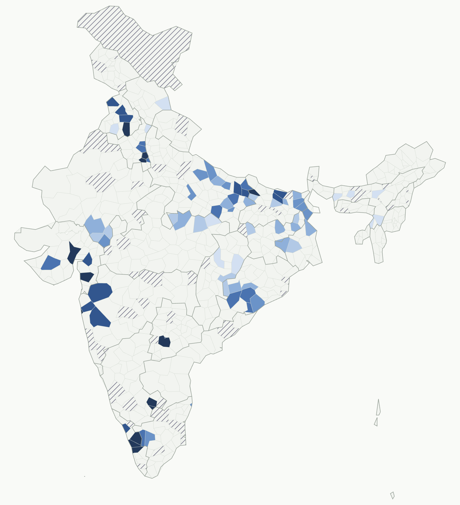
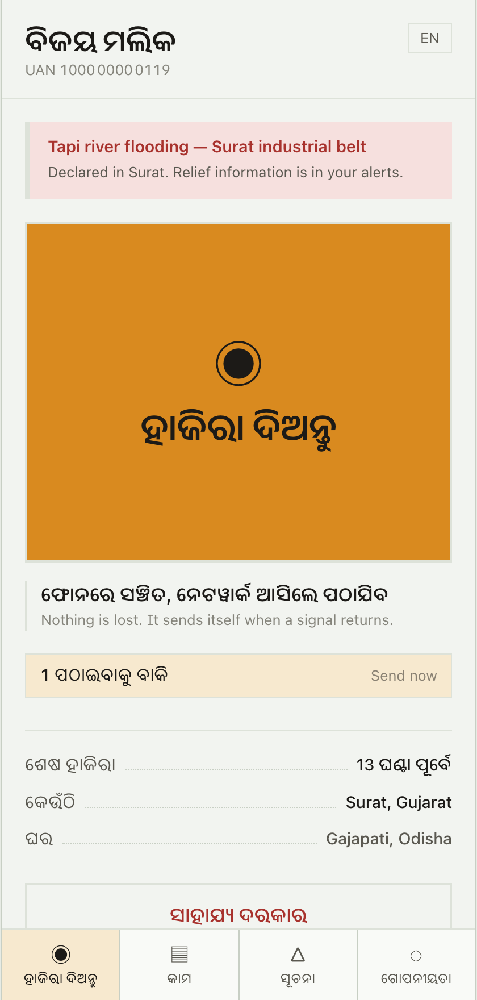

# ShramSetu · श्रम सेतु

**Presence that travels with the worker.**
Smart India Hackathon — Problem Statement 1, *Migrant Worker Tracking in eShram*
Ministry of Labour & Employment

---

## The problem

eShram holds **31.89 crore** unorganised workers (August 2026). It records each one
**once**, at enrolment, against a **home address**.

Then they migrate for work, and the record stays behind.

- Destination states cannot count the workers standing inside them.
- Welfare is delivered to the address, so it never reaches the worker.
- In 2020 no state could answer who was inside its borders.
- Migration corridors, seasonality and sector shifts are invisible to policy.

## The reframe

A tracking app fails for four reasons, and none of them are technical: low literacy
across twenty-plus languages, no smartphone for roughly one in five, no signal at the
worksite, and **no reason for a worker to maintain a government database that follows
them**.

So this is not tracking. The worker **marks their own presence**, the way a muster roll
always has, and the attestation pays them back the same day — portable ration, proof of
employment, a warning in the language they read, and a verifiable work history that gets
them the next job.

Presence data becomes a by-product of a service the worker wants, rather than a demand
made of them.

---

## What is here

| | |
|---|---|
| **Worker PWA** | One-tap presence, offline queue, work credential, consent controls, grievance filing. Installs to the home screen; opens with no network. |
| **Officer dashboard** | 726-district choropleth, migration corridors, district drill-down, crisis response, access log. |
| **Employer console** | Printable worksite QR and an attested muster roll. |
| **Privacy kernel** | Coordinate coarsening, k-anonymity with complementary suppression, scope enforcement, audited individual access. |

<p align="center">
  
  
</p>

---

## Three ways to mark presence

Channels degrade, so the system does not lose the people at the bottom.

1. **Scan the worksite code.** The employer displays a QR. Scanning attests presence and
   builds their muster roll at the same time.
2. **One tap, geofenced.** No typing, no reading. Coordinates verify the worksite
   boundary, then are discarded.
3. **Missed call.** For a feature phone. The cell tower resolves a district — which is
   the only precision retained anyway.

**Offline first.** Attestations queue in IndexedDB and send themselves when a signal
returns. A late sync never rewinds a worker's current location.

---

## The privacy argument

Officials see flows. Seeing a *person* needs a reason.

- **District granularity.** A precise coordinate exists only to verify a worksite
  geofence, then is discarded after seven days.
- **Suppression below k = 10.** A cell that small would name people. Withholding exactly
  one cell lets it be recovered by subtracting from the published total, so a lone
  suppressed cell takes its nearest neighbour down with it — standard complementary
  suppression from statistical disclosure control.
- **Withheld is visible, not silent.** The map paints suppressed districts with a hatch
  rather than rendering them as empty, because hiding the fact that something was
  withheld is the worse failure. The identity is disclosed; the count never is.
- **Individual access is gated and logged.** It requires a recorded basis — the worker's
  own SOS, a declared crisis, a filed grievance — and the worker reads the same log entry
  on their own phone.
- **Consent has no override.** In the Surat flood scenario, 10 workers who withdrew
  consent are not contacted. A consent switch that bends in an emergency was never
  consent.

The aggregate dashboard needs no sign-in, because by construction it is already safe to
publish. Identity is required to *act*. The access model is the argument.

```bash
npm run test:privacy   # 22 assertions over the guarantees above
```

---

## Where AI is used, and where it is not

A worker describes a grievance in their own language; an officer needs a category, an
urgency and something they can read.

- **Classification against a fixed schema**, not open generation.
- **The worker's words are stored verbatim** and never replaced by the model's reading.
- **The worker confirms before anything is filed**, so a wrong classification is a wrong
  suggestion rather than a wrong record.
- Whether they kept the suggestion is recorded, so triage accuracy can be **audited
  against real decisions** later.
- If no model is reachable, the worker picks from icons. The grievance is never lost.

Relief broadcasts are translated the same way: the officer writes once in English, each
worker receives it in their own language, place names and phone numbers preserved.

Nothing in the privacy kernel, the suppression logic or the presence pipeline uses a
model. Those are arithmetic, and they should stay that way.

---

## Running it

```bash
npm install
npx prisma db push    # create the schema
npm run seed          # ~30s on sqlite, ~3 min against a remote Postgres
npm run dev           # http://localhost:3100
```

Optional, in `.env`:

```
GEMINI_API_KEY="…"    # grievance triage and alert translation
```

Without it the app runs fully; triage falls back to the worker's own choice.

**Postgres or SQLite.** The schema deliberately avoids Prisma enums and scalar lists, so
the provider is a one-line swap: `npm run db:pg` or `npm run db:sqlite`, then
`npx prisma db push`. SQLite is faster to reseed while developing; Postgres is what a
deployment uses. Both are exercised by the same seed and the same tests.

Two things that cost time when switching, worth knowing:
- A running dev server keeps the previously generated Prisma client in memory. Restart it
  after any provider change or migration, or it will silently keep querying the old
  database.
- A serverless Postgres closes long-held connections mid-seed (`P1017`). The seed uses
  smaller batches and retries on a dropped connection when the target is remote.

### Tests

```bash
npm run test:privacy      # privacy guarantees
node scripts/smoke.mjs    # every route renders, no console errors
node scripts/test-checkin.mjs   # offline queue drains on reconnect
node scripts/test-sos.mjs       # grievance triage end to end
node scripts/test-crisis.mjs    # scope and consent enforcement
node scripts/test-qr.mjs <secret>  # worksite QR check-in
```

The browser tests drive the real pages through the Chrome already installed on the
machine. They need `npm run dev` running.

---

## What is real, and what is mocked

Stated plainly, because a demo that overclaims is worse than one that admits its edges.

**Real**
- 726 districts and 36 states from the 2011 boundary set, simplified to 179 KB and
  bundled — the map needs no tile server and cannot be broken by venue wifi.
- 14 migration corridors with sectors and seasonality, from Census D-series migration
  tables and the Economic Survey 2016-17 chapter on internal migration. The seeded data
  reproduces the real ordering: UP→Delhi, Odisha→Gujarat, Bihar→Punjab.
- The privacy kernel, the presence pipeline, the offline queue, scope enforcement and
  the audit trail are all working code with tests.

**Mocked**
- **eShram UAN authentication.** Consumed at an interface that mirrors the real exchange;
  no Aadhaar data is stored or requested, ever.
- **IVR / SMS gateway.** The feature-phone channel is modelled in the data and reachable
  in the code; no telecom integration is wired.
- **Every worker is synthetic.** 4,608 generated records. No real worker data is used,
  and none of the names, numbers or grievances belong to a real person.

---

## Stack

Next.js 16, React 19, TypeScript, Tailwind v4, Prisma 6, PostgreSQL (SQLite in dev),
d3-geo for the choropleth, Gemini for triage and translation.

Built solo.
